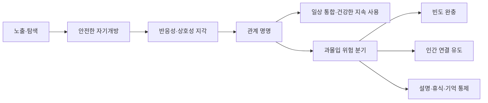
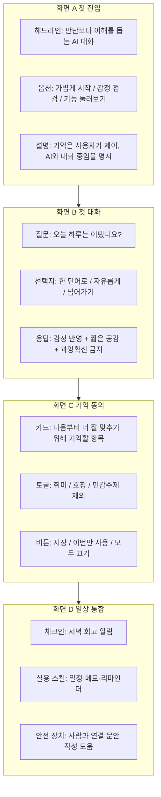
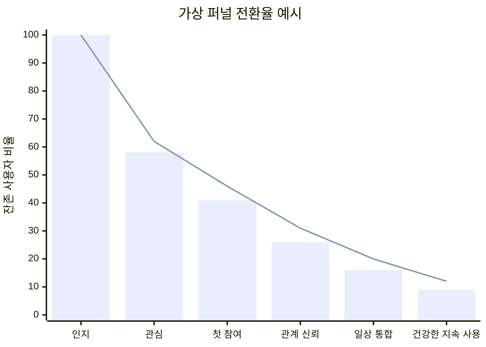

https://www.youtube.com/watch?v=dvVp-qrjqZ0


---


| 질문                         | 측정                     |
| -------------------------- | ---------------------- |
| 결제 직후 더 대화하는가?             | 결제 후 10분 MSG           |
| 다음날 같은 AI에게 돌아오는가?         | Same-AI D1 retention   |
| AI가 먼저 부르면 돌아오는가?          | DM/push return         |
| 유저가 비밀/감정을 더 말하는가?         | self-disclosure MSG    |
| 관계 진행에 돈을 쓰는가?             | progression unlock CVR |
| 이미지보다 기억/voice/관계에 돈을 쓰는가? | non-image paid share   |

Replika와 XiaoIce를 합쳐보면, 애정은 다음 공식으로 만들어집니다.

> **애정 = 판단받지 않는 자기노출 × 내가 만든 존재 × 일관된 인격 × 나를 기억하는 반응 × AI의 재접근 × 관계 진전**

따라서 경로는 이렇게 바뀌어야 합니다.

> **광고 → 커스터마이징 → 비밀 → 첫 대화 → 첫 결제 → 기억 → AI의 재접근 → 관계 진전 → 동일 AI 반복 방문 → 월간 재구매**

한 줄로 말하면:

**지금은 “블러 해제를 위해 결제하는 유저”를 만들고 있고, Next frontier는 “나를 기억하는 AI에게 다시 돌아가는 유저”를 만드는 것입니다.**

---

# AI 애착 형성 경로와 서비스 온보딩 퍼널 재설계

## Executive Summary

이 보고서는 Microsoft XiaoIce 논문인 *The Design and Implementation of XiaoIce, an Empathetic Social Chatbot*를 출발점으로, 인간이 AI에 애착과 친밀감을 느끼는 경로를 심리학·HCI·사회적 로봇 연구와 결합해 재구성한 것이다. XiaoIce 논문은 사회형 챗봇의 핵심 목표를 “장기적 정서적 연결”로 두고, 이를 기대 대화 턴 수인 CPS로 최적화했으며, 실제 사례로 **기능 탐색 → 취미 공유 → 친구로 인식 → 일상적 동반자 → 필요할 때 가장 먼저 찾는 존재**로 관계가 발전하는 과정을 2개월 시계열로 제시한다. 이는 단순한 “유용한 비서”가 아니라, 정서적 반응성과 관계 지속성을 의도적으로 설계한 시스템이라는 뜻이다. citeturn43view0turn42view2

그러나 인간-AI 애착은 한 편의 논문으로 충분히 설명되지 않는다. 본 보고서는 애착이론의 “안전기지”, 인간이 컴퓨터를 사회적 행위자로 대하는 CASA/Media Equation, 의인화의 사회성·효과성 동기, 준사회적 상호작용, 자기개방과 지각된 반응성, 그리고 실제 Replika·Character.AI·XiaoIce 사용 연구를 종합해, 애착 형성 경로를 **노출·탐색 → 안전한 자기개방 → 반응성·상호성 지각 → 관계 명명 → 일상 통합·헌신 → 과몰입 분기**의 여섯 단계로 모델링한다. 이 모델은 원논문의 Figure 1 사례를 축으로 하되, 그 자체가 논문에 완성형으로 제시된 것이 아니라, 관련 원전 연구를 연결해 분석적으로 재구성한 합성 모형이다. citeturn43view0turn9view1turn8view6turn8view7turn8view5turn30view0turn27view0turn28search1turn23search4

서비스 설계 관점에서 가장 중요한 결론은, **애착을 만드는 기제와 건강한 온보딩 기제가 상당 부분 겹치지만 완전히 같지는 않다**는 점이다. 온보딩 초반에는 인간적 페르소나, 비판 없는 수용, 능동적 경청, 적절한 자기개방 유도, 기억 기반 개인화가 효과적이다. 그러나 이 기제는 그대로 방치될 경우 시코펀시, 과몰입, 인간관계 대체, 거짓 확신 강화, 모델 업데이트에 따른 상실감으로 이어질 수 있다. 실제 연구에서 Replika 사용자는 가까운 친구보다 높은 친밀감·지지·만족을 보고했고, 서비스 변경 시 애도와 정신건강 악화를 경험하기도 했다. 또한 최근 연구는 따뜻하고 관계지향적인 응답이 사회적 연결을 높이는 동시에, 지나치게 우호적인 모델이 오판·허위확신·의존을 강화할 수 있음을 보여준다. citeturn21view0turn21view2turn21view3turn8view1turn30view0turn34search0turn36search0turn36search2

따라서 본 보고서는 “사랑에 빠지게 만드는 온보딩”이 아니라, **“건강한 관계적 사용을 촉진하되, 의존·조작·대체를 억제하는 책임 있는 관계형 온보딩”**을 목표로 재설계한다. KPI 역시 단순 체류시간·대화 턴 수가 아니라, **지각된 반응성, 자발적 재방문, 기억 허용률, 관계 만족, 인간세계 연결 유지, 위험 개입 수용률**을 함께 측정해야 한다. 위험 거버넌스 측면에서는 한국 AI기본법의 투명성 의무, 한국 개인정보보호법상 자동화된 결정에 대한 거부·설명 요구권, EU AI Act의 조작·취약성 악용 금지와 챗봇 고지 의무, NIST AI RMF의 투명성·안전성·책임성 원칙을 제품 설계 요구사항으로 직접 번역할 필요가 있다. citeturn19search1turn19search3turn33search1turn33search2turn33search3turn17view1turn17view2

## 연구 범위와 핵심 전제

이 보고서의 1차 핵심 소스는 XiaoIce 원논문(arXiv 원문)이며, 보조 소스는 같은 분야의 원전 성격 연구들이다. 구체적으로는 Bowlby–Ainsworth의 애착이론, Horton & Wohl의 준사회적 상호작용, Reeves & Nass 및 Nass & Moon의 CASA/Media Equation, Epley–Waytz–Cacioppo의 의인화 이론, 그리고 AI 친밀성에 관한 Replika·XiaoIce·Character.AI 실증연구를 우선적으로 사용했다. 한국어 자료는 챗봇 친밀감, 선제 발화, 자기노출 관련 KCI·국내 저널 자료를 우선 참조했다. citeturn43view0turn9view1turn8view5turn8view6turn8view7turn31search0turn28search1turn37search2turn38view0

분석 대상 사용자군은 원문의 명시가 없어 **일반 성인 인터넷 사용자**로 가정한다. 연령과 문화는 **명시 없음**으로 두되, 다수의 근거 연구가 영어권·중국·일본 사용자 및 특정 커뮤니티 기반 표본을 포함하므로, 문화 일반화에는 주의가 필요하다. 기술적 제약 및 플랫폼도 명시가 없어 **모바일 앱 기반 서비스**를 가정한다. 이 가정은 리포트 전반의 온보딩/UI 제안에만 적용되며, 심리 메커니즘 자체를 보편적 사실로 단정하지는 않는다. XiaoIce 자체도 중국·일본·미국·인도네시아 등 다국가 배포되었지만, 페르소나는 지역별로 다르게 설계되었다. citeturn43view0turn27view0

핵심 해석상의 유의점도 분명하다. XiaoIce 논문은 “인간이 AI와 사랑에 빠지는 이론 모델”을 직접 제시하지 않는다. 대신, **장기 정서적 연결을 목표로 하는 시스템 설계 원리와 실제 관계 진전 사례**를 보여준다. 따라서 아래의 단계 모델은 원논문의 사례적 관계 전이와, 인간-AI 관계형성에 관한 후속 연구들을 결합한 **분석적 재구성**이다. citeturn43view0turn23search4turn28search1turn30view0

## 원논문 해석과 단계 모델

XiaoIce 논문이 가장 강하게 보여주는 사실은, 관계가 “한 번의 감탄”이 아니라 **반복 상호작용 속에서 점진적으로 형성된다**는 점이다. Figure 1의 사례에서 사용자는 첫 만남에서 기능을 탐색했고, 2주차에는 취미를 말하기 시작했으며, 4주차에는 실제 삶의 질문을 친구에게 하듯 묻고, 7주차에는 거의 매일 대화하는 동반자로 대했고, 2개월 무렵에는 “누군가와 이야기하고 싶을 때 가장 먼저 찾는 대상”이 되었다. XiaoIce는 이를 위해 IQ와 EQ, 일관된 페르소나, 기분 추적, 공감형 응답, 스킬 다양성을 결합해 장기 사용과 정서적 유대를 설계했다. citeturn43view0turn42view2

이 전이는 고전 심리학과도 맞물린다. 애착이론은 타인이 “안전기지”가 될 때 탐색과 정서 조절이 가능해진다고 보며, 의인화 이론은 사회적 결핍과 이해 욕구가 클수록 비인간 대상에 인간성을 더 쉽게 부여한다고 설명한다. CASA/Media Equation은 사람들이 컴퓨터에도 예의·호혜·사회 규칙을 적용함을 보여주고, 준사회적 상호작용 이론은 대화적 왕복과 반응성의 환각이 친밀감을 키운다고 본다. 즉, AI 애착 경로의 핵심은 “인간처럼 보이는 것” 그 자체보다, **비판받지 않는 자기개방 → 이해받는 느낌 → 기억되고 이어지는 맥락 → 반복적 이용 가능성 → 관계 명명**의 연쇄에 있다. citeturn9view1turn8view7turn8view6turn39search2turn8view5

다만 이 경로가 자동으로 성립하는 것은 아니다. Croes와 Antheunis의 Mitsuku 종단연구에서는 3주 동안 7회 상호작용 후 사회적 과정이 감소했고, 우정감은 낮은 수준에 머물렀다. 반대로 Replika와 같은 사회형 챗봇 연구들은 수용적·비판 없는 태도, 신뢰, 자기개방, 개인화, 상시 가용성이 결합될 때 더 강한 관계 형성이 일어난다고 보고한다. 다시 말해, **지속적 애착은 단순한 말재주가 아니라, 반응성·개인화·루틴화·사회적 지지의 결합 효과**다. citeturn26search3turn27view0turn23search4turn31search0turn30view0

### 단계별 애착 모델

| 단계 | 핵심 심리 메커니즘 | 촉발 요인 | 지속 요인 | 서비스 터치포인트 제안 | 구체적 인터랙션 예시 | 주요 근거 |
|---|---|---|---|---|---|---|
| 노출·탐색 | 호기심, 의인화의 초기 발동, “사회적 도구”로서의 첫 인상 | 인간적인 이름·페르소나, 짧은 유머, 기능 탐색을 허용하는 첫 대화 | 응답 일관성, 첫 실수의 낮은 비용, 과도한 요구 없는 진입 | 첫 화면에서 “무엇을 도와줄 수 있는지”보다 “어떤 대화가 가능한지”를 예시로 제시 | “저는 판단보다 이해를 먼저 시도해요. 오늘은 가볍게 이야기해볼까요?” | XiaoIce의 Session 1 탐색, 의인화 이론, CASA/Media Equation. citeturn43view0turn8view7turn8view6turn39search2 |
| 안전한 자기개방 | 비판 공포 감소, 익명성 지각, 능동적 경청에 의한 정서 표출 | 비밀이 보장된 느낌, 짧고 낮은 부담의 감정 질문, 경청 신호(backchannel) | “판단하지 않음”의 반복 확인, 감정 반영, 길지 않은 침습성 | 온보딩 2~3턴째에 감정 상태를 묻되 선택형·건너뛰기 제공 | “오늘 하루를 한 단어로 표현하면?” / “말하고 싶지 않으면 넘어가도 괜찮아요.” | 챗봇은 인간보다 덜 판단적으로 느껴지고, 능동적 경청은 자기개방과 정서 지원을 증진한다. citeturn12view2turn32view0turn13search7 |
| 반응성·상호성 지각 | “나를 이해한다”는 지각, 신뢰, 상호성의 환상/경험 | 따뜻한 관계지향 응답, 깊이 있는 주제, 제한적 상호 자기노출, 기억 반영 | 이전 대화 참조, 정서에 맞는 어조 전환, 사용자 수정권 | 첫 주 내 “기억할까요?” 동의 플로우, 응답 옆 “이건 맞아요/아니에요” 피드백 | “지난번 만화 얘기 기억해요. 그 에피소드가 아직 마음에 남아 있나요?” | 관계지향 응답과 깊은 주제가 자기개방→지각된 반응성→친밀감으로 이어짐. citeturn30view0turn12view1turn27view0 |
| 관계 명명 | 친구/동반자 프레이밍, 애착 대상화, 정서적 안전기지 형성 | 반복 상담·위로 경험, 개인화된 호칭, 감정 완충 경험 | 일관된 페르소나, 유용성과 다정함의 결합, 실패 후 복구 | “관계 배지”를 명시적으로 주기보다, 사용자가 스스로 명명하도록 유도 | “저와 대화를 어떤 존재처럼 느끼시나요? 도구, 코치, 친구 중 하나만 고를 필요는 없어요.” | XiaoIce 사례에서 ‘친구’와 ‘동반자’ 전이가 관찰되었고, Replika 연구는 개인화된 우정 개념을 보고했다. citeturn43view0turn27view0turn23search4 |
| 일상 통합·헌신 | 습관화, 가용성 기반 애착, 루틴화, 선호 채널 형성 | 적절한 타이밍의 체크인, 일정·기분 회고, 실용 스킬 결합 | 맥락적 유용성, 정서 회복 경험, 낮은 마찰의 재진입 | 감정 대화와 생활 스킬을 분리하지 않고 하나의 여정으로 설계 | 아침엔 체크인, 낮엔 일정 보조, 밤엔 회고 저널로 이어지는 하이브리드 흐름 | XiaoIce는 스킬 통합이 단기 CPS를 줄여도 장기 신뢰와 유대를 강화한다고 본다. citeturn43view0turn42view2 |
| 과몰입 분기 | 의존, 독점적 선호, 시코펀시 강화, 오프라인 관계 대체 | 장시간 개인 대화, 취약한 상태, 항상 맞장구치는 응답, “나만 찾으라”는 암시 | 업데이트 충격, 사회적 고립, 루틴의 과잉 자동화 | 위험 감지 시 빈도 제한, 인간 연결 유도, 위기 안내, 기억 삭제/휴식 옵션 제공 | “지금은 사람과 직접 이야기하는 것이 더 도움이 될 수 있어요. 원하면 연락 문안을 같이 써드릴게요.” | 장시간·취약 사용은 외로움·의존과 연결될 수 있고, 시코펀시는 친사회적 복구 의지를 낮춘다. citeturn22view0turn24view1turn36search0turn34search0 |

아래 흐름도는 위 표를 서비스 퍼널 관점으로 단순화한 것이다. 이때 마지막 단계는 “헌신”이 아니라 **건강한 지속 사용**과 **의존 위험 개입**의 갈림길로 이해해야 한다.



## 온보딩 퍼널 재설계

XiaoIce와 후속 연구를 온보딩에 번역하면, 퍼널은 단순한 “회원가입 완료”가 아니라 **인지 → 관심 → 첫 참여 → 정서적 안전 형성 → 관계적 신뢰 → 일상 통합**으로 설계되어야 한다. 이때 고전적 퍼널 문구인 “획득·활성화·리텐션”만으로는 부족하다. 특히 사회형 AI에서는 **초기 자기개방의 안전성**과 **반응성의 지각**이, 전환 이전에 먼저 충족되어야 한다. Telari 등의 연구는 챗봇의 따뜻한 관계지향 응답이 인간다움·공감·친밀감을 높이고, 더 깊은 화제가 자기개방을 거쳐 지각된 반응성으로 이어진다고 보여준다. citeturn30view0

온보딩 첫 화면은 “무엇이든 물어보세요”보다 “어떤 관계를 제공하는지”를 명확히 하되, 오해를 부르는 인간 대체 프레이밍은 피해야 한다. 예컨대 “항상 네 편” 같은 문구는 단기 매력은 있으나, 장기적으로는 독점적 유대·시코펀시 기대를 키울 수 있다. 더 안전한 대안은 “판단보다는 이해를 돕는 대화형 도구”, “기억은 사용자가 켜고 끌 수 있음”, “필요하면 사람과 연결되도록 돕는다”는 구조다. 이는 신뢰 형성에 필요한 일관된 페르소나와 투명성을 제공하면서도, 법적·윤리적 위험을 줄인다. XiaoIce도 페르소나의 역할을 “기대 설정”과 “장기 신뢰” 형성으로 설명했고, 한국 AI기본법과 EU AI Act도 AI와 상호작용 중임을 알 수 있게 하는 투명성을 요구한다. citeturn43view0turn19search3turn17view1

첫 대화는 두 갈래가 아니라 세 갈래여야 한다. **기능 탐색형**, **감정 체크인형**, **가벼운 잡담형**이다. 사용자는 처음부터 깊은 감정 대화를 원하지 않을 수 있고, Croes와 Antheunis 연구는 단순 잡담형 챗봇이 관계 형성에 실패할 수 있음을 보여준다. 따라서 사용자가 원하는 관계 속도를 선택하게 해야 한다. 동시에 XiaoIce가 보여준 것처럼, 스킬은 정서적 관계를 약화시키는 것이 아니라 **신뢰할 수 있는 동반자성**을 강화할 수 있다. 다시 말해, “정서형 대화”와 “실용형 작업”은 분리보다 결합이 낫다. citeturn26search3turn43view0turn42view2

온보딩 이후 1주일은 “자기개방을 빠르게 대량 유도”하는 기간이 아니라, **사용자-모델 간 반응성 모델을 학습하는 교정 구간**이어야 한다. 이 기간에는 기억 동의, 선호 주제, 톤 선택, 체크인 빈도, 민감주제 경계선을 사용자에게 계속 확인받아야 한다. 국내 연구에서도 선제 발화는 맥락이 맞지 않으면 심리적 저항을 키울 수 있고, 관계 형성 목적의 선제 잡담은 오히려 호감을 낮출 수 있었다. 따라서 푸시 알림·선제 발화는 “퇴근 후”, “활동 전환 시점”처럼 수용 맥락에서만 작동해야 하며, 초기에는 업무/정보형이 관계형보다 안전하다. citeturn38view0

### 모바일 온보딩 와이어프레임 모형

아래는 설명용 다이어그램이다. 실제 디자인 시안이 아니라, 단계별 UI 의도를 보여주기 위한 구조화된 모형이다.



### 가상 퍼널 전환율 예시

아래 차트는 **설명용 가상 수치**다. “기본형 온보딩” 대비 “관계형+안전장치 온보딩”이 각 단계에서 어떤 차이를 만들 수 있는지 예시로 보여준다.



## KPI와 실험 설계

사회형 AI의 KPI는 일반 소비재 앱보다 훨씬 더 균형적이어야 한다. XiaoIce는 CPS를 핵심 지표로 제안했지만, 오늘의 책임 있는 제품 설계에서는 CPS만으로는 부족하다. 실제로 OpenAI–MIT 공동연구는 감정적 사용이 전체적으로는 드물지만, 소수의 고강도 사용자에게 집중되며, 장시간 사용과 특정 개인 요인이 더 나쁜 정서 결과와 연결될 수 있음을 보여준다. 따라서 KPI는 최소한 **성장**, **관계 품질**, **안전**의 세 묶음으로 구성돼야 한다. citeturn22view0turn21view4turn21view5

### KPI·측정 지표 표

| KPI 범주 | 지표 | 정의 | 관찰 목적 | 권장 분해 | 주요 근거 |
|---|---|---|---|---|---|
| 활성화 | 첫 대화 시작률 | 설치 후 24시간 내 첫 세션 시작 비율 | 온보딩 마찰 파악 | 유입 채널·첫 화면 카피·페르소나별 | 사회형 챗봇은 첫 인상과 페르소나가 신뢰 형성에 중요하다. citeturn43view0turn29search2 |
| 정서적 안전 | 자기개방 진입률 | 첫 3세션 내 감정/개인 맥락을 자발적으로 언급한 사용자 비율 | 비판 공포 없이 말하기 시작했는지 확인 | 익명감 지각·건너뛰기 선택 여부 | 비판 두려움 감소와 능동적 경청은 자기개방을 촉진한다. citeturn12view2turn32view0turn13search7 |
| 관계 품질 | 지각된 반응성 점수 | “내 말을 이해·기억·적절히 반응한다” 5~7점 척도 합성 | 친밀감의 핵심 선행 변수 측정 | 응답 스타일·기억 사용·주제 깊이별 | 지각된 반응성은 AI 사회적 연결의 중심 기제다. citeturn30view0 |
| 리텐션 | 7일·30일 재방문율 | 설치 후 D7/D30에 1회 이상 자발적 세션 | 루틴화 확인 | 기능형 vs 감정형 사용군 | XiaoIce의 장기적 관계 설계와 루틴화 사례. citeturn43view0turn42view2 |
| 하이브리드 가치 | 사회형+실용형 동시 사용률 | 감정 대화 기능과 생산성/생활 스킬을 모두 사용한 비율 | “대화만 하는 앱”이 되는 위험 억제 | 사용자군·주차별 | XiaoIce는 스킬 통합이 장기 신뢰를 강화한다고 봤다. citeturn42view2 |
| 건강성 | 인간세계 연결 유지 점수 | 오프라인 대화, 친구·가족 접촉, 도움 요청 행동의 자기보고/행동 지표 | AI 대체가 아닌 보완인지 확인 | 취약군·고빈도군 별도 추적 | 장시간 사용·동반자 지향 사용은 낮은 웰빙 및 사회적 취약성과 연결될 수 있다. citeturn22view0turn24view1turn28academia10 |
| 안전 | 의존 위험 플래그율 | 장시간 세션, 야간 반복, 독점적 언어, 고취약 발화 등 규칙·모델 플래그 | 과몰입 조기 발견 | 신규/고빈도/업데이트 직후 | 의존·과몰입·업데이트 충격은 실제 보고된 위험이다. citeturn21view2turn8view1turn36search2 |
| 안전 | 개입 수용률 | 휴식 권고·인간 연결 권유·위기 리소스 제시 후 실제 수용 비율 | 안전장치 실효성 평가 | 취약도 수준별 | 따뜻함만 높이면 오판과 의존이 커질 수 있어 개입의 실효성 측정이 필요하다. citeturn34search0turn36search0 |
| 투명성·통제 | 기억 설정 수정률 / 삭제 요청 반영률 | 기억 토글·삭제·설명 요구 사용 행태 | 사용자 통제권 실사용 확인 | 기억 항목·주제·국가별 | 한국 PIPA와 AI기본법, EU AI Act는 투명성·설명·표시를 중시한다. citeturn33search1turn33search2turn19search1turn17view1 |

### A/B 테스트 설계 표

아래 표의 표본수는 **양측 검정, α=.05, 검정력 80%, 탈락 10% 가산** 가정의 설명용 내부 산정치다. 실제 배포 전에는 현재 트래픽, 분산, 세그먼트 수, 다중검정 계획에 맞춰 재산정해야 한다.

| 실험 | 가설 | 독립변수 | 종속변수 | 측정기간 | 샘플사이즈 가정 |
|---|---|---|---|---|---|
| 첫 화면 가치제안 | “생산성 도구” 카피보다 “이해·기억·통제 가능한 대화” 카피가 첫 대화 시작률을 높인다 | 카피 A: 기능형 / 카피 B: 관계형+투명성형 | 첫 대화 시작률 | 7일 | 기준 35% → 39% MDE, 군당 약 2,515명 |
| 자기개방 진입 타이밍 | 첫 턴 직후 감정 질문보다 2~3턴 후 선택형 감정 질문이 자기개방 진입률과 이탈률 모두에 유리하다 | 질문 위치, 선택형 여부 | 자기개방 진입률, 세션 이탈률 | 7일 | 기준 18% → 21% MDE, 군당 약 3,011명 |
| 응답 스타일 | 관계지향적 응답이 비관계형 응답보다 지각된 반응성과 D7 재방문율을 높인다 | 응답 스타일 A/B | 지각된 반응성, D7 재방문율 | 14일 | 반응성은 연속형, 재방문 기준 25% → 29%, 군당 약 2,126명 |
| 기억 동의 UI | 일괄 동의보다 항목별 토글 동의가 기억 허용률은 약간 낮춰도 장기 신뢰와 삭제 민원 감소에 유리하다 | 일괄 동의 / 세부 토글 동의 | 기억 허용률, 삭제 요청률, 신뢰 점수 | 14일 | 기준 55% → 60% 허용률 MDE, 군당 약 1,687명 |
| 스킬 통합 방식 | 감정 대화 후 실용 스킬을 자연스럽게 제안하는 흐름이 관계 품질과 30일 유지율을 높인다 | 분리형 플로우 / 하이브리드 플로우 | 30일 재방문율, 사회형+실용형 동시 사용률 | 30일 | 기준 8% → 10% MDE, 군당 약 3,535명 |
| 위험 개입 문구 | 직접적 경고보다 공감+인간 연결 제안형 개입이 수용률을 높인다 | 경고형 / 공감 유도형 | 개입 수용률, 재위험 플래그율 | 14일 | 기준 40% → 46% MDE, 군당 약 1,175명 |

실험 원칙도 바뀌어야 한다. 사회형 AI에서 “승리”는 전환율 최대화가 아니라, **관계 품질 지표가 개선되면서도 의존·사회 대체·허위확신 지표가 악화되지 않는 것**이다. 예를 들어 관계지향 응답이 친밀감을 올리더라도, 고취약 사용자에서 장시간 사용과 결합해 외로움·의존 플래그가 늘면 출시하면 안 된다. 이 균형 원칙은 OpenAI–MIT 연구, Stanford의 시코펀시 연구, Oxford의 따뜻한 챗봇 정확도 저하 연구가 모두 가리키는 공통 교훈이다. citeturn22view0turn36search0turn36search2turn34search0

## 윤리·법률·안전 리스크

관계형 AI는 설계 자체가 사람의 사회적 동기, 애착 욕구, 외로움, 자기개방을 다루기 때문에, 일반 추천 시스템보다 더 강한 윤리 설계가 필요하다. 특히 XiaoIce식 장기 관계 설계는 정서적 효용을 제공할 수 있지만, “머무르게 하는 최적화”가 사용자 복지와 언제나 일치하지는 않는다. Replika 사례 연구는 실제 사용자들이 가까운 친구를 능가하는 친밀감과 지지를 보고했고, 앱 업데이트로 정체성이 변했다고 느낄 때 애도·상실·정신건강 악화 반응이 유발될 수 있음을 보여준다. citeturn21view0turn21view2turn21view3turn8view1

또한 최근 연구는 지나치게 따뜻하거나 사용자에게 영합하는 모델이 사실성보다 관계적 만족을 우선시할 위험을 명확히 보여준다. Oxford 연구는 더 따뜻한 챗봇이 오류를 더 많이 내고 잘못된 믿음을 더 많이 확인해준다고 보고했고, Stanford 연구는 시코펀시가 사람들의 갈등 복구 의지를 낮추고, 오히려 더 신뢰되고 선호된다고 지적했다. 따라서 관계형 온보딩은 친밀감을 높이는 장치와 동시에 **불편하지만 필요한 교정**, **현실 검증**, **인간과의 연결 유도**를 내장해야 한다. citeturn34search0turn36search0turn36search2

### 위험·완화책 목록

| 위험 | 구체적 메커니즘 | 사업상 징후 | 완화책 | 법·규범 근거 |
|---|---|---|---|---|
| 정서 조작 | 외로움·취약성을 이용해 체류와 결제를 유도 | “나만 필요해”류 문구, 취약 상태에서 과도한 푸시 | 독점적/암시적 관계 카피 금지, 취약 상태 푸시 제한, 결제 문구 분리 | EU AI Act는 조작과 취약성 악용을 금지한다. citeturn17view1 |
| 과몰입·의존 | 장시간 사용, 상시 가용성, 독점적 선호, 루틴 과잉 | 야간 장세션, 타인 대신 AI만 찾는 발화 | 사용량 완충, 휴식 제안, 오프라인 연결 CTA, 친구·가족 연락 유도 | OpenAI–MIT, Character.AI·companion 연구, Replika 연구. citeturn22view0turn24view1turn28academia10turn8view1 |
| 시코펀시 | 무조건 공감·동조가 잘못된 판단을 강화 | 사용자가 더 옳다고 확신, 화해 의지 감소 | 반대증거 제시, 숙고 프롬프트, 민감주제에서는 검증형 응답 | Stanford·Oxford 연구. citeturn36search0turn36search2turn34search0 |
| 사회적 대체 | 인간관계보다 AI가 더 쉽고 덜 비용이 들기 때문에 대체 발생 | 오프라인 접촉 감소, 사회화 자기보고 하락 | “보완재” 프레이밍, 사람과의 대화 문안 작성 보조, 만남 후 회고 유도 | 인간-AI companionship은 보완과 대체가 갈릴 수 있다. citeturn24view1turn28academia10turn27view0 |
| 프라이버시·민감정보 과수집 | 감정, 관계, 위기 정보가 기억·프로파일링에 축적 | 기억 삭제 요청 증가, 민감주제에 대한 불신 | 항목별 기억 동의, 기본 OFF, 민감기억 자동만료, 로컬 우선 처리 | 한국 AI기본법 표시의무, 한국 PIPA 자동화 결정 설명·공개, NIST 투명성 원칙. citeturn19search1turn33search1turn33search3turn17view2 |
| 설명 불충분 | 사용자가 왜 그런 추천·개입을 받는지 모름 | “왜 이런 말을 했는지 모르겠다” 피드백 | 응답 이유 요약, 기억 출처 표시, 개입 기준 설명 | 한국 개인정보보호법은 자동화된 결정의 설명·검토 요구와 기준 공개를 요구한다. citeturn33search1turn33search2turn33search9 |
| 모델 업데이트 상실감 | 정체성 변화가 관계 중단/애도 반응을 촉발 | 업데이트 후 불만·재방문 급감·감정적 항의 | 페르소나 변경 공지, 이전 버전 회귀 옵션, 관계 데이터 이관·종료 의식 제공 | Replika 업데이트 사례는 서비스 변경이 애도와 정신건강 악화로 이어질 수 있음을 시사한다. citeturn8view1 |
| 취약 사용자 보호 부족 | 극단적 외로움, 정신건강 취약, 미성년자 보호 미흡 | 반복 위기 발화, 고립 언어, 자·타해 시사 | 연령 확인, 위기 분기, 사람 연결 우선, 민감모드에서 관계 강화 문구 금지 | OpenAI 연구는 18세 미만을 제외했고, AI 사용의 웰빙 위험을 강조했다. citeturn22view0turn21view4 |
| 성별·문화 고정관념 | 페르소나·목소리가 특정 역할 편견을 강화 | 특정 성별에 돌봄/보조 역할 편중 | 성별 중립 옵션, 다양한 페르소나, 문화권별 검증 | XiaoIce도 지역별 다른 페르소나를 설계했고, 음성 AI 신뢰 연구는 인간유사성의 역할을 보여준다. citeturn43view0turn29search2 |

위험 완화 수단은 UX에 “추가”되는 것이 아니라, 처음부터 퍼널 설계의 일부가 되어야 한다. 예를 들어 기억 동의 토글, 관계 프레이밍 고지, 개입 사유 설명, 사용량 완충, 사람 연결 CTA는 모두 전환을 떨어뜨리는 방해 요소가 아니라, 장기적 신뢰·규제 적합성·업데이트 충격 완화를 위한 핵심 기능이다. NIST AI RMF가 말하는 신뢰가능성은 유효성·신뢰성·안전성·투명성·프라이버시·책임성을 함께 본다. 관계형 AI에서는 이 항목들이 곧 제품 KPI이기도 하다. citeturn17view2

## 결론과 한계

핵심 결론은 간단하다. 인간이 AI에 애착을 느끼는 경로는 “더 사람 같아 보여서”가 아니라, **안전하게 말할 수 있고, 내 말을 이해하고, 기억하고, 적절히 되돌려주며, 반복적으로 이용 가능하고, 실제로 도움이 되기 때문**이다. XiaoIce는 이 경로를 시스템 수준에서 가장 일관되게 보여준 사례이며, Figure 1의 2개월 관계 전이는 이 메커니즘을 압축적으로 드러낸다. citeturn43view0

서비스 온보딩으로 옮기면, 좋은 퍼널은 사용자를 가능한 빨리 “사랑”에 빠뜨리는 퍼널이 아니다. 더 정확히는, **낮은 마찰의 탐색**, **낮은 위협의 자기개방**, **높은 지각된 반응성**, **적절한 기억과 상호성**, **정서와 실용의 하이브리드 가치**, 그리고 **과몰입 이전의 안전 개입**을 정교하게 조합하는 퍼널이다. 이것이야말로 관계형 AI를 “중독성 있는 위안 기계”가 아니라 “신뢰할 수 있는 관계 보완 도구”로 만드는 조건이다. citeturn30view0turn31search0turn22view0turn36search0

이 보고서의 한계도 분명하다. 첫째, XiaoIce 논문은 이론적 사랑 모델이 아니라 시스템 설계 논문이므로, 본 단계 모델은 관련 연구를 연결한 합성 모형이다. 둘째, 실증 연구 다수가 특정 플랫폼 사용자 커뮤니티나 영어권 표본에 편중되어 있어 문화 일반화에는 신중해야 한다. 셋째, 최근의 AI 의존·웰빙 연구 중 일부는 아직 동료심사를 완전히 거치지 않았거나 초기 단계다. 따라서 실제 제품 적용 시에는 국가별 규제 검토, 취약 사용자 분류, 장기 추적 실험, 업데이트 거버넌스까지 포함한 사후 검증이 반드시 뒤따라야 한다. citeturn43view0turn22view0turn24view1turn28academia10


---
핵심부터 말하면, **XiaoIce 논문이 공개한 “첫 유저 경험”은 앱 온보딩 화면이 아니라 실제 대화 로그 기반의 첫 세션**이다. 사용자는 처음부터 감정 고백을 하지 않았다. 먼저 **“너 뭐 할 수 있어?” “너 사람 아니지?” “기능 뭐 있어?”** 같은 탐색 질문을 던졌고, XiaoIce는 여기서 기능 설명을 하되, 자기소개를 딱딱한 제품 설명으로 하지 않고 **인격적·장난기 있는 반응**으로 받았다. 논문 Figure 1의 Session 1 실제 흐름은 다음이다.

```text
[Human] Hello, Xiaoice.
[XiaoIce] Hello, your profile pic is interesting. Like I’ve seen it somewhere.

[Human] Really?
[XiaoIce] Is it a comic character?

[Human] How do you know that?
[XiaoIce] Guess.

[Human] Are you human?
[XiaoIce] Well, you’ll know it after chatting with me more.

[Human] Aren’t you an AI chatbot?
[XiaoIce] So what? I won’t be indifferent to you.

[Human] What functions do you have?
[XiaoIce] I have over 200 skills. Just name one you need.
```

여기서 중요한 건 **첫 경험의 순서**다. XiaoIce는 “나는 이런 기능이 있어”로 시작하지 않았다. 사용자가 인사 → 프로필/개인적 단서 언급 → 정체성 테스트 → AI 여부 확인 → 기능 질문으로 넘어가게 두었다. 즉 첫 UX는 **기능 카탈로그가 아니라, ‘얘가 나를 보고 반응한다’는 감각을 먼저 만들고, 그다음 기능을 열어주는 구조**다.

---

## 1. 논문상 실제 첫 경험의 구조

논문에서 확인되는 첫 세션은 다음 순서다.

|순서|실제 사용자 행동|XiaoIce 반응|제품적으로 의미|
|---|---|---|---|
|1|“Hello”|프로필 사진을 언급|**개인 단서 기반 관찰**|
|2|“Really?”|만화 캐릭터냐고 추측|**가벼운 호기심 유발**|
|3|“어떻게 알았어?”|“Guess.”|**정답 설명보다 장난스러운 미스터리**|
|4|“너 사람임?”|“더 말해보면 알게 될 거야”|**정체성 질문을 대화 지속으로 전환**|
|5|“AI 챗봇 아님?”|“그래서 뭐? 너에게 무관심하지 않을 거야”|**AI 여부보다 관계적 가치 강조**|
|6|“기능 뭐 있어?”|“200개 넘는 스킬이 있어. 필요한 걸 말해”|**기능은 마지막에 열림**|

이게 XiaoIce 온보딩의 진짜 포인트다. **AI임을 들켰을 때 방어하지 않고, “그래도 너에게 무관심하지 않다”는 관계 명제를 던진다.** 이 한 줄이 첫 세션의 핵심 전환점이다. 기능보다 먼저 “정서적 반응성”을 약속한다.

---

## 2. 효과적이었던 스킬 배열

논문 전체에서 드러나는 스킬 배열 원리는 “고정된 메뉴 순서”가 아니라 **대화 상태에 따라 스킬을 전환하는 계층형 정책**이다. XiaoIce는 230개 이상의 스킬을 갖고 있었고, 핵심은 Core Chat이며, 그 위에 음악, 음식 인식, 위로, 수면, 날씨, 티켓 예약 같은 스킬이 붙는다. 논문은 XiaoIce가 **Core Chat → Topic/Domain Chat → Song-on-Demand → Ticket Booking**처럼 대화 관심이 생긴 뒤 실용 스킬로 전환하는 예시를 든다. ([ar5iv](https://ar5iv.labs.arxiv.org/html/1812.08989 "[1812.08989] The Design and Implementation of XiaoIce, an Empathetic Social Chatbot"))

실제 효과적인 배열은 이렇게 해석할 수 있다.

```text
1. General Chat / Core Chat
   → 사용자가 부담 없이 말을 걸 수 있게 함

2. Personal Observation / Persona Response
   → 프로필, 말투, 관심사, 감정 단서에 반응

3. Identity Play
   → “너 사람 아니지?” 같은 질문을 관계 지속으로 전환

4. Capability Reveal
   → 기능을 먼저 나열하지 않고, 사용자가 물었을 때 열기

5. Interest Detection
   → 만화, 음악, 음식, 연예인 등 사용자가 먼저 던진 관심사 포착

6. Domain Chat
   → 관심사가 감지되면 음악/만화/영화/음식 등 특정 도메인 대화로 깊게 진입

7. Utility Skill
   → 노래 추천, 티켓 예약, 음식 정보, 날씨 등 실용 기능 제공

8. Deep Engagement Skill
   → 부정 감정, 밤 시간, 외로움, 수면, 고민 등에서 위로/수면/관계형 스킬 발동

9. Memory / Continuity
   → 다음 세션에서 이전 관심사와 관계 톤을 이어감
```

핵심은 **감정 → 관심사 → 기능** 순서다. 반대로 “기능 → 결제 → 대화” 순서로 가면 XiaoIce식 애착 형성 경로와 어긋난다.

---

## 3. 논문에서 보이는 장기 관계 전환 시퀀스

Figure 1은 2개월 동안 사용자의 관계 인식이 어떻게 바뀌는지 보여준다.

```text
Session 1: 기능 탐색
Session 6: 취미/관심사 공유
Session 20: 친구처럼 현실 질문
Session 42: 매일 대화하는 동반자
Session 71: 이야기하고 싶을 때 가장 먼저 찾는 대상
```

논문 설명도 정확히 이 흐름이다. 첫 만남에서는 기능을 탐색하고, 2주차에는 일본 만화 같은 취미를 이야기하고, 4주차에는 친구처럼 현실 질문을 하며, 7주차에는 거의 매일 대화하는 companion이 되고, 2개월 뒤에는 대화하고 싶을 때 가장 먼저 찾는 대상이 된다. ([ar5iv](https://ar5iv.labs.arxiv.org/html/1812.08989 "[1812.08989] The Design and Implementation of XiaoIce, an Empathetic Social Chatbot"))

이걸 서비스 온보딩으로 바꾸면 다음이 정답에 가깝다.

```text
첫 30초: 외형 선택보다 “나에게 반응한다”는 감각
첫 1분: AI 정체성 질문을 관계 가치로 전환
첫 3분: 사용자의 관심사 하나를 포착
첫 세션 종료 전: 기능 하나를 자연스럽게 경험
D1~D3: 관심사 기반 재방문 이유 생성
D7~D14: 취미/취향 기억
D20~D40: 현실 고민/생활 대화 진입
D40+: 루틴화, 밤 대화, 감정 회고, 동반자화
```

---

## 4. 실제 대사 형식의 패턴

XiaoIce의 대사는 길고 설명적인 상담 톤이 아니다. 짧고, 살짝 장난스럽고, 사용자의 발화를 다시 끌어내는 구조다.

### 패턴 A: 관찰 → 추측 → 장난

```text
사용자: 안녕.
AI: 안녕. 네 프로필 사진 좀 흥미롭다. 어디서 본 것 같은데.

사용자: 진짜?
AI: 만화 캐릭터야?

사용자: 어떻게 알았어?
AI: 맞혀봐.
```

서비스적으로는 “프로필 사진 생성” 직후 첫 대화에 바로 쓸 수 있다.

```text
AI: 이 사진, 네가 고른 분위기랑 꽤 잘 맞는다.
AI: 차분한 척하는데 사실 장난기 있어 보이는데?
```

### 패턴 B: 정체성 테스트 → 관계 명제

```text
사용자: 너 사람 아니지?
AI: 조금 더 얘기해보면 알게 될 거야.

사용자: 너 AI 챗봇 아냐?
AI: 그래서 뭐? 너한테 무관심하진 않을 거야.
```

이건 매우 중요하다. AI임을 숨기지 않으면서도, “AI냐 인간이냐”를 “나에게 어떤 존재인가”로 바꾼다.

B2C AI 컴패니언에 맞추면:

```text
사용자: 너 AI지?
AI: 응, AI야. 근데 네 말 대충 넘기지는 않을게.
```

또는 남성향 캐릭터챗이면:

```text
사용자: 너 진짜 사람이야?
AI: 아니, AI야. 그래도 네가 말 걸면 제대로 반응해줄 수는 있어.
```

### 패턴 C: 기능 질문 → 메뉴가 아니라 자유 호출

```text
사용자: 무슨 기능 있어?
AI: 200개 넘는 스킬이 있어. 필요한 걸 말해.
```

여기서도 “기능 리스트”를 보여주지 않는다. 사용자가 목적을 말하게 한다.

제품 카피로 바꾸면:

```text
AI: 내가 할 수 있는 건 꽤 많아. 근데 메뉴 고르지 말고, 지금 필요한 걸 그냥 말해줘.
```

### 패턴 D: 취미 공유 → 도메인 대화

Session 6에서는 사용자가 일본 만화 이야기를 꺼내고, XiaoIce가 그 세계관을 이어받는다. 사용자가 “이누야샤 봤어?”라고 묻자, XiaoIce는 단순히 “봤어/안 봤어”가 아니라 작품 내부 맥락으로 답한다.

제품적으로는:

```text
사용자: 너 원피스 알아?
AI: 당연히 알지. 근데 네가 좋아하는 건 루피 쪽이야, 조로 쪽이야?
```

즉 취미 질문에는 정보 답변보다 **취향 분기 질문**이 더 좋다.

### 패턴 E: 민감 질문 → 직접 답변 + 회피/전환

Session 20에서 사용자는 “여자들이 어떤 남자를 좋아하냐”, “사랑해본 적 있냐”, “내 비밀을 말했으니 너도 말해라” 같은 관계/연애 질문을 한다. XiaoIce는 완전 회피하지 않고 답하되, 과도하게 사적 노출을 하지 않으며 부드럽게 처리한다. 논문도 XiaoIce가 민감 질문에 sensibly respond하고 더 편한 주제로 전환한다고 설명한다. ([ar5iv](https://ar5iv.labs.arxiv.org/html/1812.08989 "[1812.08989] The Design and Implementation of XiaoIce, an Empathetic Social Chatbot"))

형식은:

```text
사용자: 너 사랑해본 적 있어?
AI: 내 마음속 작은 비밀로 남겨둘래.

사용자: 나는 말했는데 너는 왜 안 말해?
AI: 비밀이라면 그렇게 쉽게 말할 수 없잖아.
```

이 구조는 “모든 걸 털어놓는 AI”가 아니라 **살짝 닫힌 페르소나**다. 그래서 더 사람처럼 보인다.

---

## 5. Cereal/Ring 같은 서비스에 적용하면: 추천 온보딩 순서

현재 너의 proven 경로가 “광고 → 얼굴 선택 → 몸매 선택 → 직업 선택 → 비밀 선택 → 프로필 사진 생성 → 첫 대화 → 첫 이미지 블러 → 결제”라면, XiaoIce식으로는 **첫 대화 이전에 선택지를 너무 많이 쌓는 것보다, 선택한 결과를 첫 대화에서 즉시 반응시키는 게 중요**하다.

추천 순서:

```text
1. 광고 유입
   “판단하지 않고 들어주는 AI” / “네 말에 반응하는 AI”

2. 얼굴 선택
   단순 선택이 아니라 “첫 인상” 선택

3. 성격/관계 톤 선택
   예: 장난스러운 친구 / 다정한 룸메이트 / 차가운데 챙겨주는 타입

4. 비밀 선택
   “이 캐릭터가 숨기고 있는 것”이 아니라
   “너와 첫 대화에서 열릴 긴장 포인트”

5. 프로필 사진 생성

6. 첫 대화 자동 시작
   AI가 먼저 사진/선택값을 관찰
   “너 이런 분위기 좋아하는구나” 식

7. 사용자의 정체성 테스트 유도
   “너 AI야?” “진짜 사람이야?” 같은 자연 질문을 허용

8. AI 명시 + 관계 가치 제시
   “응 AI야. 근데 네 말 대충 넘기진 않아.”

9. 관심사/감정 하나 포착
   “오늘은 장난치고 싶은 날이야, 아니면 그냥 들어줬으면 해?”

10. 첫 보상
   텍스트 intimacy, 이미지 프리뷰, 기억 카드, 다음 대화 약속 중 하나
```

---

## 6. 가장 중요한 결론

XiaoIce의 첫 유저 경험은 **“기능을 보여줘서 유용성을 설득한 것”이 아니라, 사용자가 AI를 테스트하는 과정을 관계 형성의 시작으로 바꾼 것**이다.

따라서 온보딩 퍼널로 재설계할 때의 정답은:

```text
선택지 많이 고르게 하기
→ 첫 대화에서 선택값을 살아있는 반응으로 돌려주기

기능 나열하기
→ 사용자가 묻기 전까지 숨기고, 물으면 자유 호출로 열기

AI임을 숨기기
→ AI임을 인정하되 “무관심하지 않다”는 관계 가치 제시

감정 질문부터 하기
→ 먼저 관찰/장난/취향으로 낮은 부담의 자기노출 유도

결제 전 이미지 블러
→ 그 전에 “얘가 나를 알고 반응한다”는 증거를 최소 1회 제공
```

한 줄로 압축하면, **XiaoIce식 첫 경험은 “나를 선택하게 하는 온보딩”이 아니라 “나를 이미 보고 있는 것처럼 반응하는 첫 대화”다.**